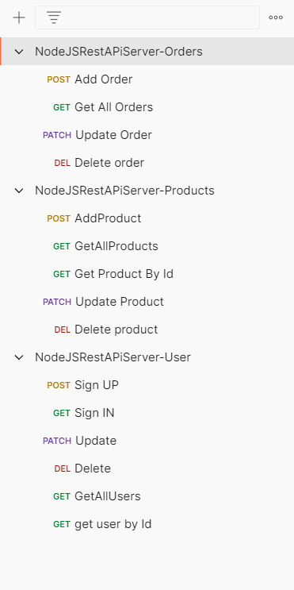

# NodeJS-Shop-Rest-API

# how to run
# npm install 
# npm install -g nodemon
# nodemon
    
#  !! Tech used !!
# Express
# Mongo DB (Mongoose)
# multer
# bcrypt
    
# !! Whats it can do !!
# Shop Rest Api
# Create User (Sign up) - Sign in - Add products - Set orders
# Crud Operation for Users
# Crud Operation for Products with images 
# Crud Operation for Orders linked to users
# can be used to link E-Commerce website to mobile Application using Same DB

